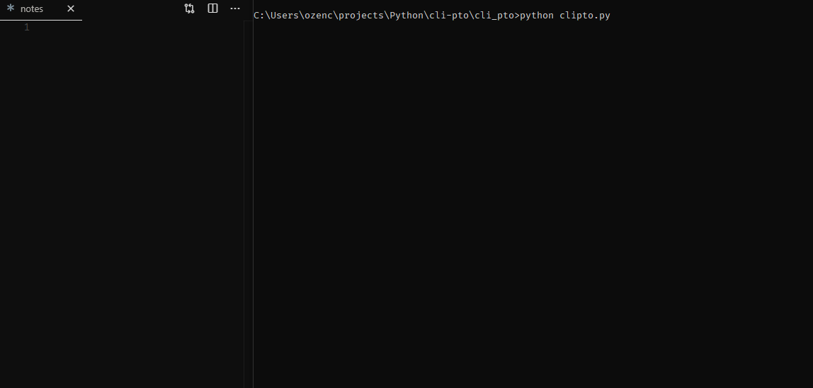

# cli-pto

## Description
**cli-pto** is a CLI text editor with encryption

## Installation
Run `python setup.py install` to install cli-pto

## Usage
Simply run `cli-pto` to run. You can provide a file name as an argument to skip file dialog

## Contribution
Please feel free to fork the repository and issue pull requets if you would like to contribute to the project.

### Credits

A special thanks to [Jonathan Slenders](https://github.com/jonathanslenders) for creating [Prompt Toolkit](https://github.com/prompt-toolkit/python-prompt-toolkit), an interactive CLI library. And thanks to [Helder Eijs](https://github.com/Legrandin) for [pycryptodome](https://github.com/Legrandin/pycryptodome).

This project is heavily dependent on these incredible libraries.